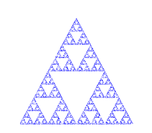

<h1 align="center">
   
   

# Sierpiński triangle - Chaos game

## A fun little python code to draw a Sierpinski Triangle using the turtle library.
***

  <a href="#key-features">Key Features</a> •
  <a href="#Sierpiński-triangle">Sierpiński triangle</a> •
  <a href="#Why?">Why?</a> •
  <a href="#To-Do">To Do</a>

<!--  -->

## Key Features

* The following libraries are used
  - turtle
  - PIL
  - random
  - time
* The parameters for the triangle corners are set.
* It selects a random point on the bottom edge to start.
* It selects a random corner and plots a point half way to that corner.
* This last step is repeated 'num_dots' times.
* Once finished a postscript vector file is saved of the compiled triangle.
* time is used to measure how long the program takes in seconds.
* 'done()' is used at the end to keep the canvas open when finished.
* It is beautiful to watch it grow.

## Sierpiński triangle

> The Sierpiński triangle (sometimes spelled Sierpinski), also called the Sierpiński gasket or Sierpiński sieve, is a fractal attractive fixed set with the overall shape of an equilateral triangle, subdivided recursively into smaller equilateral triangles. Originally constructed as a curve, this is one of the basic examples of self-similar sets—that is, it is a mathematically generated pattern that is reproducible at any magnification or reduction. It is named after the Polish mathematician Wacław Sierpiński, but appeared as a decorative pattern many centuries before the work of Sierpiński.
[Wikipedia](https://en.wikipedia.org/wiki/Sierpi%C5%84ski_triangle "link to Wikipedia page") 

There are different ways to draw the triangle. In this version, I have used Chaos Game

## Why?

I saw a [video on reddit](https://www.reddit.com/r/Damnthatsinteresting/comments/zd5ml6/how_sierpinskis_triangle_a_famous_fractal/) of a person drawing one and thought it would be fun to program (it was). The video comes from a TikTok channel called [Math Letters](https://www.tiktok.com/@mathletters). There is also a really interesting video on [Youtube by Numberphile](https://www.youtube.com/watch?v=kbKtFN71Lfs) called Chaos Game that shows this and other fractals.

Why start on the bottom line? The triangle works if the start point is completly random but you can end up with a few dots in the empty triangles. starting from the edge keeps it looking neater.

Why turtle? It's fun.

## To Do

* Math Letters also does a Sierpinski Hexagon - so I might code that too!
* This process is slow, so optimization is needed.
* There are other ways of creating a Sierpiński triangle - Why not code those too.

***

Copyright © 2023 Pete Foss
